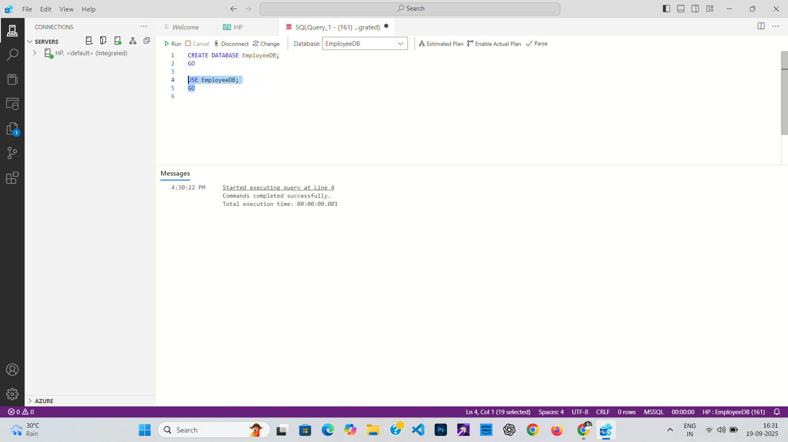
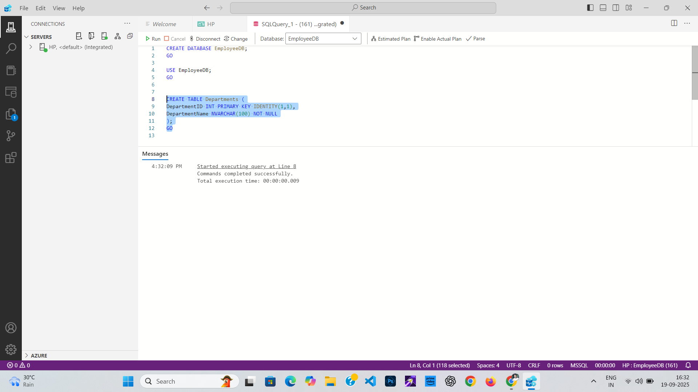

# Employee Management System

This is an **Advanced SQL project for Week 4**.  
It implements an Employee Management System as per the official project PDF, including:

- Employee and Department table creation
- Inserting sample data
- Subqueries for analysis
- User-defined function for employee full names

All SQL queries and screenshots are as per project instructions.

---

## How to Use

1. Download `week4_project.sql` and run each section in **Microsoft SQL Server Management Studio** or **Azure Data Studio**.
2. See the [`Screenshots/`](./Screenshots) folder for output proof at each step.

---

## Project Steps with Screenshots

| Step | Description | Screenshot |
|------|-------------|------------|
| 1 | Create database |  |
| 2 | Use database |  |
| 3 | Create Departments table |  |
| 4 | Create Employees table |  |
| 5 | Insert Departments data |  |
| 6 | Insert Employees data |  |
| 7 | Above average salary query |  |
| 8 | IT department employees query |  |
| 9 | Create `GetFullName` function |  |
| 10 | Use `GetFullName` function |  |

---

## Project Steps (Summary)

- Database creation
- Table creation
- Data insertion
- SQL queries for subqueries and functions
- All steps are according to the Week 4 project PDF

---

## Author

Avinash Kumar Gupta

*For educational use and project demonstration only.*
